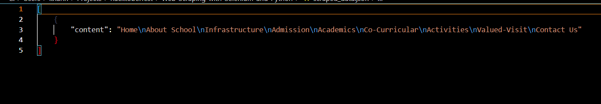

# Simple WebScrapper

Enter the URL of the website and the class element and the relevant data gets downloaded in the format [ csv/json ], based upon what did the user selected.

## Aim :
To learn ab0ut webscrapping with a hands-on experience.

## Project Usage

### Requirements

- pip install -r requirements.txt


### Command to run project

- python scraper.py

#### Exampe

Project getting used, example:


JSON File so formed:



## License

This project is licensed under the MIT License.

---

If you have any questions or need further assistance, feel free to ask! 🚀

## Steps to contribute and generate PR(pull request)

### Clone the repository

Clone the forked repository to your system. Go to your GitHub account, open the forked repository, click on the code button and then clone the repository.
If you want to use the terminal, use the following commands after you fork the repository, open the terminal type the given command:

```
git clone https://github.com/<your_username>/Web-Scraping-with-Selenium-and-Python
```

### Create a branch

Create a branch on your local repository to solve a problem.

```
git checkout -b your_new_branch_name
```

### Add & Commit

Add your changes (folder) to that branch.
Make necessary changes and commit those changes.

```
git add .
git commit -m "your-commit-message"
```

### Push changes to GitHub

Finally, push your local repository to the remote repository compare & submit a pull request

```
git push origin
```

Go to your repository on GitHub, you'll see a compare & pull request button. Click on that button.

Now submit the pull request.

For quick approval of the pull request, reach out to me on the mentioned social media channels.

```bash


 _____ _                 _     __   __
|_   _| |               | |    \ \ / /
  | | | |__   __ _ _ __ | | __  \ V /___  _   _
  | | | '_ \ / _` | '_ \| |/ /   \ // _ \| | | |
  | | | | | | (_| | | | |   <    | | (_) | |_| |
  \_/ |_| |_|\__,_|_| |_|_|\_\   \_/\___/ \__,_|


______
|  ___|
| |_ ___  _ __
|  _/ _ \| '__|
| || (_) | |
\_| \___/|_|


______      _               _   _               _
| ___ \    (_)             | | | |             | |
| |_/ / ___ _ _ __   __ _  | |_| | ___ _ __ ___| |
| ___ \/ _ \ | '_ \ / _` | |  _  |/ _ \ '__/ _ \ |
| |_/ /  __/ | | | | (_| | | | | |  __/ | |  __/_|
\____/ \___|_|_| |_|\__, | \_| |_/\___|_|  \___(_)
                     __/ |
                    |___/


```

---

```javascript
function starThisRepository() {
  let repository = "https://github.com/pythonprogramming-development/Web-Scraping-with-Selenium-and-Python";
  return repository.⭐;
}

function forkThisRepository() {
  let repository = "https://github.com/pythonprogramming-development/Web-Scraping-with-Selenium-and-Python"
  return repository.🍴;
}
if (youEnjoyed) {
  starThisRepository();
  forkThisRepository();
}
```

---

## Happy coding fellas!!💕✨

---
---
---
---

#### Sam's Youtube Channel (irrelevant with regards to the current repo and hacktoberfest too) 

<details>
  <summary>Welcome to SAM YouTube channel! 🎉</summary>
  In this channel, I share exciting content related to web development. Whether you're interested in Angular, Javascript, or Productivity tips, you'll find something valuable here.

  [YouTube Channel](http://youtube.com/@neweraofcoding)
</details>

## About Me

<details>
  <summary>About Me</summary>
  I'm Sam, and I'm passionate about product engineering and web development. I create videos that will help you learn web development.
</details>

## What You'll Find Here

<details>
  <summary>Angular</summary>
  Learn the fundamentals. I explained everything you need to get started with this JavaScript framework written in TypeScript. It is the web development framework for building the future. works at any scale. Loved by millions. Build for everyone. open-source framework for building single-page client applications using HTML and TypeScript.
</details>

<details>
  <summary>Javascript</summary>
  JavaScript is a powerful programming language that can add interactivity to a website. JavaScript is easy to learn. It's the foundation of frontend web development.
</details>

<details>
  <summary>Career Tips</summary>
  Self-assessment, goal setting, action planning, implementation, and refinement. By following these steps, you can develop a road map for achieving your career goals. Tips to improve your career development. Cultivating a beginner's mindset is a critical part of career growth. critical part of your professional growth.
</details>

<details>
  <summary>Common Errors</summary>
  Mistakes to Avoid in Software Development Projects.
</details>

<details>
  <summary>Development Tools</summary>
  Top Software Development Tools List.
</details>

<details>
  <summary>Typescript</summary>
  TypeScript extends JavaScript by adding types to the language. TypeScript speeds up your development experience by catching errors. TypeScript can help enhance and improve your web development projects.
</details>

<details>
  <summary>Git & GitHub</summary>
  GitHub is where over 100 million developers shape the future of software together. Contribute to the open-source community and manage Git repositories. This practical guide gets you to jump right into using GitHub, learning the basics of Git. Git and GitHub are two of the most essential tools in the world of software development.
</details>

<details>
  <summary>Video Conferencing Tool</summary>
  Unlock the potential of video conferencing software development. Dive into our guide for insights on key features and cost factors. If you're looking to integrate video communication into your app or planning to build a video streaming/conference app from scratch, create a fully customized audio & video conferencing app.
</details>

## Subscribe and Stay Updated!

<details>
  <summary>Subscribe and Stay Updated!</summary>
  Don't miss out on new videos! Subscribe to my channel and hit the notification bell 🔔 to receive updates whenever I upload fresh content. Let's learn, laugh, and explore together!

  [Subscribe to My Channel!](http://youtube.com/@neweraofcoding)
</details>

## Connect with Me

<details>
  <summary>Connect with Me</summary>
  - **YouTube**: [YouTube Channel Link](http://youtube.com/@neweraofcoding)
  - **Facebook**: [Facebook Page Link](https://www.facebook.com/learnangular2plus/)
  - **Instagram**: [Instagram Page Link](https://www.instagram.com/angular_development/)
  
  Feel free to reach out, comment on videos, and share your thoughts. I appreciate your support! 🙌
</details>
